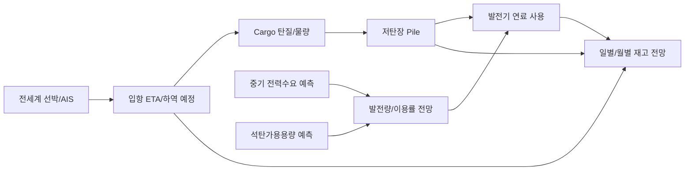
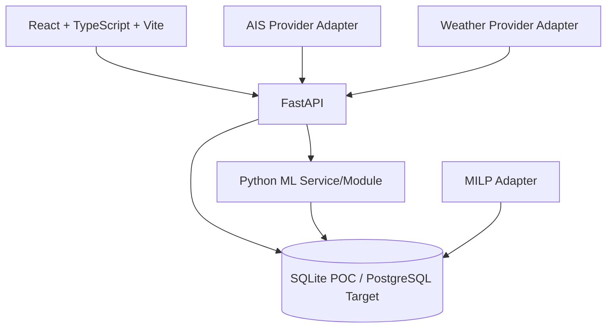

# 연료수급 종합시스템 제품·기술 스펙

- 문서 버전: v0.1
- 기준일: 2026-10-06
- 개발 단계: POC → 시범운영 → 본 운영
- 데이터 원칙: POC는 더미데이터만 사용. 실제 사내 데이터와 API Key는 GitHub에 저장하지 않음.

## 1. 제품 정의

### 1.1 한 줄 정의

발전소를 중심으로 **현재 연료재고, 입하 예정 석탄의 열량·성상, 운항 선박 ETA, 저탄장 Pile 상태, 발전기 이용률·발전량·연료사용 전망**을 하나의 흐름으로 연결하는 연료수급 Control Tower.

### 1.2 핵심 질문

시스템은 사용자가 다음 질문에 즉시 답할 수 있어야 한다.

1. 발전소별 현재 석탄 재고는 몇 톤이며 며칠분인가?
2. 앞으로 들어올 선박은 어디에 있고, 현재 속도와 예상 도착일은 언제인가?
3. 해당 선박의 석탄 열량·수분·회분·황분은 얼마인가?
4. 입하 예정 물량까지 고려하면 발전소 재고는 일별·월별로 어떻게 변하는가?
5. 저탄장의 어느 Pile에 어떤 탄종이 몇 톤 저장되어 있는가?
6. 어느 Pile이 장기적치·자연발화 측면에서 위험한가?
7. 각 발전기의 현재/전망 이용률과 발전량은 얼마이며 연료를 얼마나 사용할 것인가?
8. 중기 전력수요와 석탄가용용량 예측모델의 성능과 학습상태는 어떤가?
9. ETA 지연, 체선, 높은 발전량 등 조건이 바뀌면 재고 위험시점이 어떻게 변하는가?

## 2. 제품 원칙

### 2.1 발전소 중심

최상위 화면과 데이터의 중심 키는 `plant_id`다. 선박, Cargo, 저탄장, 발전기, 예측결과는 모두 최종적으로 발전소에 연결한다.

### 2.2 데이터 흐름 중심



### 2.3 POC와 본 운영 분리

POC에서는 더미데이터와 공개/무료 데이터로 데이터 흐름과 UI/계산 정확성을 검증한다. 실제 사내 데이터, 계약 데이터, 센서, 유료 위성 AIS는 이후 Adapter만 교체하여 연결할 수 있어야 한다.

## 3. 범위

### 3.1 POC 범위

- 발전소 종합 화면
- 저탄장 Pile 화면
- 전세계 선박 추적 화면
- 더미 선박/Cargo/탄질/발전/재고 데이터
- AIS Provider 추상화 및 AISstream POC Adapter
- 현재 재고 + 입항예정 - 예상사용량 기반 일별/월별 재고 계산
- 발전기별 현재 및 전망 이용률
- 중기 전력수요 예측 모델 실행/학습곡선 표시
- 석탄가용용량 예측 모델 실행/학습곡선 표시
- 모델 결과를 연료사용량/재고전망에 연결
- 체선료/ETA 지연 샘플 계산

### 3.2 POC 제외 범위

- 실제 계약금액 정산
- 실제 사내 인증/SSO
- 실시간 DCS 제어
- 자동 발전기 기동/정지 지시
- 자연발화 자동제어
- 유료 위성 AIS 구매/계약
- 실제 상업운영을 위한 24x7 SLA

## 4. 사용자와 역할

| 역할 | 주 사용 목적 | 주요 화면 |
|---|---|---|
| 연료수급 담당 | 재고/입항/탄질/체선 판단 | 발전소 종합, 선박, 저탄장 |
| 발전계획 담당 | 발전량·이용률·연료사용 전망 | 발전소 종합, 예측 |
| 관리자/통합담당 | 데이터 및 모델 정상 여부 확인 | 전체 |

개발팀 3명 기준 소유권은 다음으로 고정한다.

| 담당 | 기능 소유권 | 기본 브랜치 |
|---|---|---|
| 통합 담당 | 발전소 종합, 재고계산, 공통 계약, PR merge | `feature/plant-integration` |
| 팀원 A | 선박/AIS/ETA/기상/체선 | `feature/vessel-tracking` |
| 팀원 B | 저탄장/Pile/탄질/자연발화 Risk | `feature/stockyard` |

## 5. 화면 정보구조

내비게이션 순서는 고정한다.

1. 발전소 종합
2. 저탄장 현황
3. 선박 추적
4. 예측/모델 상세(2차)
5. 데이터/관리자(2차)

### 5.1 발전소 종합 화면

최상단 발전소 선택기와 기간 선택기(30/60/90일)를 제공한다.

필수 KPI:

- 현재 총 저탄량(t)
- 현재 재고일수(day)
- 입하 예정 물량(t)
- 입하탄 가중평균 열량(kcal/kg)
- 현재 저탄 가중평균 열량(kcal/kg)
- 발전기 평균 이용률(%)
- 7일 전망 이용률(%)
- 일평균 예상 연료사용량(t/day)
- 최저 예상 재고일수와 발생 예정일

필수 시각화:

- 발전소별 재고/입하/재고일수 비교
- 호기별 현재 이용률 및 7일 전망 이용률
- 30/60/90일 일별 재고량 전망
- 일별 입항 물량
- 일별 예상 연료사용량
- 중기 전력수요 ML 학습곡선
- 석탄가용용량 ML 학습곡선
- 모델 검증지표(MAE/RMSE/MAPE)

### 5.2 저탄장 화면

필수 KPI:

- 발전소 총 저탄량(t)
- Pile 수
- 가중평균 열량
- 탄종별 비중
- 최장 적치일수
- 고위험 Pile 수

Pile별 필수 정보:

- `stockpile_id`
- 탄종
- 현재 재고(t)
- 발열량(kcal/kg)
- 수분(%)
- 회분(%)
- 황분(%)
- 적치 시작일
- 적치일수
- 온도(향후 센서 연결)
- CO/가스(향후 센서 연결)
- 자연발화 위험등급
- 사용 가능 발전기/호기

필수 시각화:

- 부두 → Conveyor → Stacker → Pile → Reclaimer 흐름
- Pile별 크기를 재고량에 비례하여 표현
- Pile 색상으로 정상/주의/위험 표시
- 탄종별 구성비
- 적치일수 × 위험지수 Scatter

### 5.3 선박 추적 화면

지도는 전세계 범위를 기본으로 한다.

필수 정보:

- 선박명
- MMSI
- IMO
- 현재 위도/경도
- SOG 현재 속도(kn)
- COG 진행방향
- 마지막 AIS 수신시각
- 위치 Freshness 상태
- 출항항/목적항
- 목적 발전소
- AIS ETA
- 자체 보정 ETA
- 잔여거리(nm)
- Cargo 물량(t)
- 탄종
- 열량/수분/회분/황분
- 예상 기상지연(h)
- 예상 접안 대기(h)
- 예상 체선료

Freshness 상태:

- `LIVE`: 10분 이내
- `RECENT`: 1시간 이내
- `ESTIMATED`: 6시간 이내, 마지막 위치+속도+항로로 추정
- `STALE`: 6시간 초과

AIS Provider는 인터페이스로 분리한다. POC에서는 AISstream을 사용할 수 있으나 위치 공백이 존재할 수 있음을 전제로 한다. 유료 위성 AIS Provider로 교체해도 프론트와 도메인 로직은 변경하지 않는다.

## 6. 핵심 계산 정의

### 6.1 현재 재고

```text
current_stock_t = SUM(stockpile.on_hand_t WHERE plant_id = selected_plant)
```

### 6.2 입하 예정 물량

```text
incoming_t(horizon) = SUM(cargo.quantity_t
                          WHERE destination_plant_id = selected_plant
                          AND forecast_unload_end <= horizon_end
                          AND voyage_status NOT IN ('cancelled'))
```

### 6.3 입하탄 가중평균 열량

```text
incoming_weighted_cv = SUM(cargo.quantity_t * cargo.calorific_value_kcal_kg)
                       / SUM(cargo.quantity_t)
```

### 6.4 일별 재고 전망

```text
stock[d] = stock[d-1]
         + unloaded_cargo[d]
         - forecast_fuel_use[d]
         + manual_adjustment[d]
```

POC에서 `manual_adjustment[d]` 기본값은 0이다.

### 6.5 재고일수

현재값:

```text
inventory_days = current_stock_t / forecast_daily_use_t
```

미래 일자:

```text
forecast_inventory_days[d] = projected_stock[d]
                           / forward_7d_average_fuel_use[d]
```

### 6.6 발전량 → 석탄 사용량

Heat Rate를 사용하는 경우:

```text
fuel_t = generation_mwh * heat_rate_kcal_kwh / coal_hhv_kcal_kg
```

예: 10,000MWh × 2,200kcal/kWh ÷ 5,500kcal/kg = 4,000t.

### 6.7 발전기 이용률

```text
utilization_pct = actual_or_forecast_generation_mwh
                / (available_capacity_mw * period_hours)
                * 100
```

### 6.8 ETA 보정

```text
predicted_eta = base_eta_from_route_and_speed
              + weather_delay
              + route_delay
```

접안시각은 별도로 계산한다.

```text
predicted_berth_at = predicted_eta + expected_port_wait
```

## 7. 중기 예측 모델 스펙

### 7.1 중기 전력수요 예측

POC 목표:

- 예측기간: D+1 ~ D+90
- 기본 단위: 일 단위
- 출력: 일평균 수요 MW, 일최대 수요 MW
- 향후 확장: 시간대별 24개 값

초기 Feature 후보:

- 월/요일/공휴일
- 과거 수요 Lag
- 이동평균
- 온도/습도
- 냉난방도일
- 계절
- 태양광 추정량

모델 인터페이스:

```python
class DemandForecastModel:
    def fit(self, train_df, valid_df) -> "TrainingResult": ...
    def predict(self, feature_df) -> "ForecastSeries": ...
```

학습 화면 표시:

- Train Loss
- Validation Loss
- Epoch/Iteration
- MAE
- RMSE
- MAPE
- Training data range
- Model version

### 7.2 석탄가용용량 예측

목표값:

```text
available_coal_capacity_mw[date, plant/unit]
```

초기 Feature 후보:

- 호기별 정비계획
- 과거 고장/정지 패턴
- 발전기 Pmin/Pmax
- 과거 이용률
- 수요전망
- 태양광/재생에너지 전망
- 계통/송전 제약 Flag
- 연료재고일수
- 탄종/열량

POC에서는 ML 예측값을 **운영 참고값**으로만 사용하고, 확정 가용용량을 자동으로 결정하지 않는다.

학습 화면에는 전력수요 모델과 동일하게 Train/Validation curve와 검증지표를 표시한다.

## 8. MILP/발전량 전망 연결

POC 1차에서는 예측 이용률 또는 단순 발전계획으로 연료사용량을 계산한다.

2차에서는 MILP Adapter를 통해 다음 값을 받는다.

```json
{
  "unit_id": "DANGJIN_5",
  "timestamp": "2026-10-07T12:00:00+09:00",
  "is_on": true,
  "generation_mw": 487.0,
  "reserve_mw": 42.0
}
```

MILP는 연료수급 UI와 직접 결합하지 않는다. 결과를 `generation_forecast` 표준 계약으로 저장하고 재고계산 엔진이 이를 소비한다.

## 9. 데이터 모델

핵심 식별자:

```text
plant_id
  ├── unit_id
  ├── stockpile_id
  └── voyage.destination_plant_id
         └── cargo_id
                └── coal_quality_id

vessel_id
  └── voyage_id
         └── cargo_id
```

### 9.1 Plant

```json
{
  "plant_id": "DANGJIN",
  "name": "당진발전소",
  "timezone": "Asia/Seoul"
}
```

### 9.2 Unit

```json
{
  "unit_id": "DANGJIN_5",
  "plant_id": "DANGJIN",
  "name": "당진 5호기",
  "capacity_mw": 500,
  "heat_rate_kcal_kwh": 2200
}
```

### 9.3 VesselPosition

```json
{
  "vessel_id": "IMO1234567",
  "mmsi": "440123456",
  "received_at": "2026-10-06T12:00:00+09:00",
  "latitude": 14.2,
  "longitude": 124.7,
  "sog_kn": 12.8,
  "cog_deg": 21.4,
  "source": "aisstream",
  "freshness": "LIVE"
}
```

### 9.4 Voyage/Cargo

```json
{
  "voyage_id": "VOY-2026-001",
  "vessel_id": "IMO1234567",
  "origin_port": "Newcastle",
  "destination_port": "Dangjin",
  "destination_plant_id": "DANGJIN",
  "forecast_arrival_at": "2026-10-08T15:30:00+09:00",
  "forecast_berth_at": "2026-10-08T23:30:00+09:00",
  "cargo": {
    "cargo_id": "CGO-2026-001",
    "quantity_t": 78500,
    "coal_type": "AUS-NEWC",
    "calorific_value_kcal_kg": 6120,
    "moisture_pct": 8.7,
    "ash_pct": 11.2,
    "sulfur_pct": 0.52
  }
}
```

### 9.5 Stockpile

```json
{
  "stockpile_id": "D-A01",
  "plant_id": "DANGJIN",
  "coal_type": "AUS-NEWC",
  "on_hand_t": 62000,
  "calorific_value_kcal_kg": 6100,
  "moisture_pct": 8.4,
  "ash_pct": 10.9,
  "sulfur_pct": 0.49,
  "stacked_at": "2026-09-25T08:00:00+09:00",
  "risk_level": "LOW"
}
```

## 10. API 계약

Base URL:

```text
/api/v1
```

필수 Endpoint:

```text
GET  /plants
GET  /plants/{plant_id}/summary?horizon_days=30
GET  /plants/{plant_id}/units
GET  /plants/{plant_id}/inventory/forecast?horizon_days=90

GET  /stockpiles?plant_id=DANGJIN
GET  /stockpiles/{stockpile_id}

GET  /vessels?plant_id=DANGJIN
GET  /vessels/{vessel_id}
GET  /vessels/{vessel_id}/track?hours=168
WS   /ws/vessels

GET  /forecasts/demand?plant_id=DANGJIN&horizon_days=90
GET  /forecasts/coal-capacity?plant_id=DANGJIN&horizon_days=90
GET  /model-runs?model_type=demand

GET  /alerts?plant_id=DANGJIN
```

프론트는 데이터베이스에 직접 접근하지 않는다.

## 11. 시스템 아키텍처



권장 기술스택:

- Frontend: React, TypeScript, Vite
- 지도: MapLibre GL JS + 로컬 GeoJSON 세계지도(POC), 향후 Tile Provider 교체
- 차트: Apache ECharts
- Backend: Python 3.12, FastAPI, SQLAlchemy 2.x, Pydantic 2.x
- DB: SQLite(로컬 POC) → PostgreSQL(시범/본 운영)
- Migration: Alembic
- ML: pandas, scikit-learn, XGBoost
- Test: Vitest, React Testing Library, pytest
- Optimization: 향후 SciPy/HiGHS Adapter

외부 CDN은 사용하지 않는다. npm/pip 의존성은 빌드 시 로컬에 설치한다.

## 12. Repository 구조

```text
fuel-supply-control-tower/
├── README.md
├── .env.example
├── .gitignore
├── docs/
│   ├── SPEC.md
│   ├── DATA_DICTIONARY.md
│   └── superpowers/plans/
├── web/
│   ├── package.json
│   └── src/
│       ├── app/
│       ├── features/
│       │   ├── plant/
│       │   ├── stockyard/
│       │   └── vessels/
│       ├── shared/
│       └── contracts/
├── api/
│   ├── requirements.txt
│   ├── alembic/
│   └── app/
│       ├── main.py
│       ├── db/
│       ├── modules/
│       │   ├── plant/
│       │   ├── stockyard/
│       │   └── vessels/
│       ├── integrations/
│       │   ├── ais/
│       │   └── weather/
│       └── contracts/
├── ml/
│   ├── demand/
│   ├── coal_capacity/
│   └── common/
├── data/
│   └── dummy/
└── tests/
```

## 13. 상태/Alert 규칙

초기 더미 기준이며 관리자 설정값으로 전환한다.

### 재고일수

- 안정: 30일 이상
- 주의: 20일 이상 30일 미만
- 위험: 20일 미만

### AIS Freshness

- LIVE: 10분 이내
- RECENT: 1시간 이내
- ESTIMATED: 6시간 이내
- STALE: 6시간 초과

### Pile 자연발화 Risk

POC Risk Score 예시:

```text
risk_score = age_score + temperature_score + co_score + coal_type_score
```

센서가 없는 더미 POC에서는 적치일수와 탄종계수로만 계산하고 UI에 `SIMULATED`를 명시한다.

## 14. 비기능 요구사항

- 발전소 선택 변경 후 주요 KPI는 1초 이내 화면 반영
- 90일 재고전망 API는 POC 데이터 기준 2초 이내
- 지도에 200개 선박까지 표시 가능
- 모든 수치는 단위와 기준시각을 표시
- 데이터가 오래되면 최신값처럼 표시하지 않고 Freshness 표시
- 더미/실제 데이터 여부를 UI에서 구분
- API Key와 비밀번호를 Git에 Commit하지 않음
- `.env`는 `.gitignore` 처리
- 테스트 없이 핵심 재고계산식을 변경하지 않음

## 15. GitHub 협업 규칙

1. `main` 직접 작업 금지.
2. 새 작업은 `main → Pull → feature branch` 순서.
3. 기능별 폴더 소유권을 우선 존중.
4. 공통 데이터 계약 변경은 통합 담당 승인 후 merge.
5. PR 없이 merge 금지.
6. API Key, 회사 실제 데이터, 비밀번호 Commit 금지.
7. 더미데이터 필드명도 임의 변경 금지. 변경 시 계약 문서와 테스트를 동시에 수정.

## 16. POC 완료 기준

POC는 다음이 모두 만족되면 완료다.

- 발전소 선택 시 재고·입하탄 열량·재고일수·이용률이 일관되게 변경된다.
- 저탄장 Pile 합계와 발전소 현재 재고가 일치한다.
- 선박 Cargo 물량과 입항예정 물량이 일치한다.
- 선박 지도에서 현재 위치·속도·ETA·목적 발전소·탄질을 볼 수 있다.
- 30/60/90일 재고전망이 계산되고 입항 지연 시 결과가 변한다.
- 발전량/이용률 변화가 연료사용량과 재고전망에 반영된다.
- 전력수요 및 석탄가용용량 모델의 Train/Validation curve와 MAE/RMSE/MAPE를 볼 수 있다.
- AIS 데이터가 오래되면 LIVE처럼 표시되지 않는다.
- 세 명이 각자 브랜치에서 작업 후 PR로 main에 통합할 수 있다.

## 17. 이후 확장

- 실제 계약/선적 데이터 Adapter
- 유료 Satellite AIS
- 기상청/해양기상 API
- 항만혼잡/체선 예측모델
- 저탄장 온도/CO Sensor 연동
- 혼탄 최적화
- 기존/신규 MILP 발전계획 연동
- 연료구매/선박 스케줄 통합 최적화
- 알림/보고서 자동 생성
