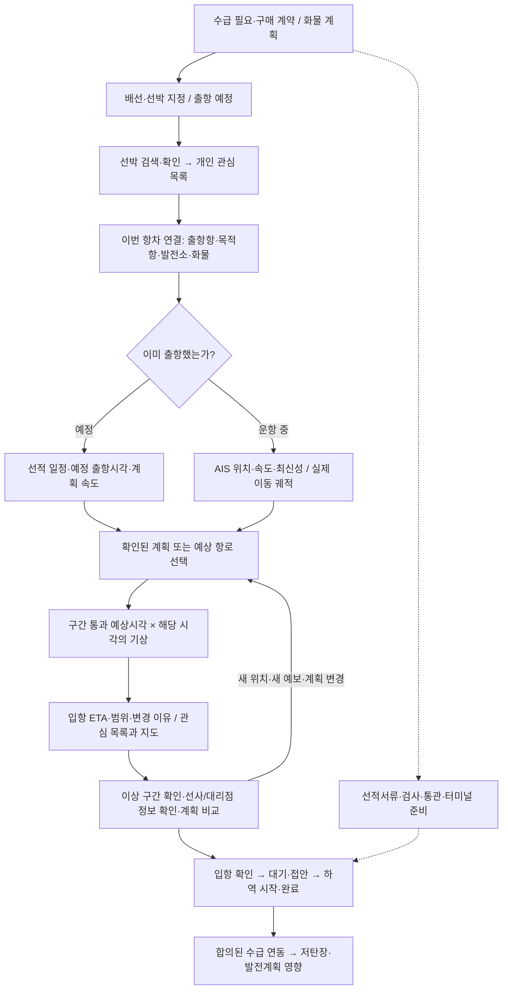
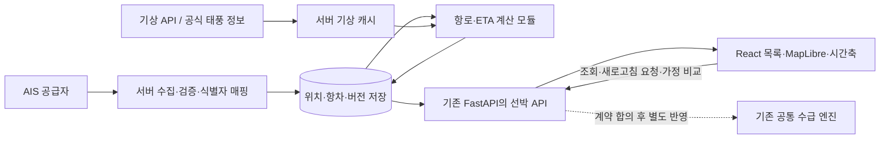

# 선박 ETA·기상 기반 도착 일정 워크플로 설계

- 작성일·공식 문서 확인일: 2026-10-09 KST
- 상태: 논의용 설계 초안. 화면·API·공통 데이터 계약에는 아직 적용하지 않음.
- 사용자 확정 방향: **첫 화면은 선박별 ETA와 지연 원인 우선**, 이후 발전소 입하 영향으로 연결. 로그인은 후속 범위.
- 작업 기준: `feature/vessels-tracking`의 현재 코드. 기존 지도 작업과 사용자 파일을 보존하고 이 문서만 추가한다.
- 기준 문서: [SPEC](../../../SPEC.md), [데이터 사전](../../DATA_DICTIONARY.md), [디자인 시스템](../../../DESIGN.md), [백엔드 이관 계약](../../MIDTERM_INTEGRATION.md).

## 1. 제품이 답할 질문

사용자가 우리 화물을 운송하는 선박을 찾아 관심 목록에 담고, **언제 도착하는지, 지난 예측보다 얼마나 달라졌는지, 어떤 근거 때문에 달라졌는지, 다음에 무엇을 확인해야 하는지** 판단하도록 한다.

지도는 이 판단의 근거를 보여준다. 현재 위치, 지나온 궤적, 남은 예상 항로, 해당 구간을 지날 때의 기상, 입항 이후 일정을 하나의 시간축으로 연결한다. 선박의 실제 운항 지시나 항해 안전 판정을 수행하는 시스템으로 설계하지 않는다.

### 사용자 아이디어에 더할 맥락

| 원래 흐름 | 빠지기 쉬운 맥락 | 권장 UX |
|---|---|---|
| 우리 배를 검색한다 | 배의 이름은 중복·변경될 수 있고, AIS 미수신은 선박 부재를 뜻하지 않는다 | 이름·IMO·MMSI 검색, 식별자 확인, 검색 범위·최종 수신시각 표시, 직접 등록 경로 |
| 관심 선박에 추가한다 | 개인의 관심 표시와 팀의 실제 운송 계약은 다르다 | 관심 등록은 즉시 완료. 우리 화물·목적 발전소·이번 항차 연결은 별도 단계 |
| 항로를 가져온다 | 실제 이동 궤적, 선사가 제공한 계획, 시스템이 만든 예상 경로는 다르다 | 선 종류와 출처로 구분하고 경로 버전을 보존 |
| 날씨로 ETA를 바꾼다 | 현재의 날씨가 아니라 통과 예상 시각의 날씨가 중요하다. 기상 노출이 곧 확정 지연 원인은 아니다 | 구간별 통과 시각과 예보를 결합하고 관측 사실·예상 영향·가정을 분리 |
| 도착 일정을 보여준다 | 항구 도착, 접안, 하역 완료는 다른 사건이다 | 일정을 별도 마일스톤으로 표시하고 재고 반영은 기존 엔진 계약을 따름 |

## 2. 현재 구현과 새 설계의 차이

| 항목 | 현재 코드에서 확인한 상태 | 이번 설계 |
|---|---|---|
| 선박 데이터 | `src/data/control-tower.ts`의 고정 표본. 실제 AIS 미연결 | 검색/식별자 원장 + 서버 수집 위치 + 항차 등록 |
| AIS 경계 | `src/domain/ais.ts`에 PositionReport decoder와 Proxy Adapter 존재 | 서버 수집·보존·재연결·정적 정보 매핑 추가. 브라우저는 자체 서버만 조회 |
| ETA | `voyageTiming()`은 AIS ETA에 표본 지연을 더함 | 실제 잔여 항로·항해 속도 기반 추정과 기상 시나리오를 구분 |
| 최신성 버튼 | 시간만 다시 비교하는 `최신성 재평가` | `업데이트 확인`은 서버 데이터/수집 상태 확인. 새 AIS 수신을 강제로 일으키는 버튼은 아님 |
| 지도 | MapLibre/OpenFreeMap, 지구본·평면·도트 모프·샘플 항로 | 같은 지도에 실제 궤적·예상 경로·기상과 시간 선택을 추가 |
| 백엔드 | `backend/src/midterm/web/app.py`에 FastAPI 존재. SQLite 수급·MILP 조회 기능 보유 | 기존 서버에 별도 선박 모듈을 연결. MILP 계산을 ETA 갱신마다 실행하지 않음 |
| 식별자 | 표본의 `vessel_id`가 `voyage_id`와 같거나, decoder에서 MMSI로 채워짐 | 선박/항차/외부 식별자 매핑을 명시적으로 분리하는 계약 제안 |
| 재고 | React 데모와 Python 수급 엔진의 하역 반영 방식이 다름 | §11의 연동 경계 합의 전에는 조회·비교만 제공 |

`docs/DATA_DICTIONARY.md` 마지막의 백엔드 미제공 문장은 기존 데모 설명과 현재 백엔드 상태가 섞여 있다. 위 현황은 실제 코드와 문서 앞부분의 MILP 계약을 기준으로 확인했다. 이 설계 작업에서 기존 문서를 임의로 수정하지 않는다.

## 3. 권장 접근: 무료 우선의 혼합 방식

| 접근 | 장점 | 한계 | 판단 |
|---|---|---|---|
| **등록한 선박 + 무료 AIS + 공개 기상 + 검토 가능한 예상 항로** | 작은 비용으로 전체 업무 흐름을 만들 수 있고 출처를 분리하기 쉽다 | 처음 보는 선박의 검색·해양 AIS 공백·항로 정확도에 한계 | **POC 권장** |
| 상용 선박 데이터 API 중심 | 선박 원장·과거 이력·위성 위치 등을 계약 범위에서 확보 가능 | 비용·재배포 조건·서비스별 데이터 범위 확인 필요 | 실제 운송선의 수신 공백이 업무를 막을 때 비교 도입 |
| AIS·전 세계 기상·항로망을 모두 자체 운영 | 통제 범위가 넓다 | 수집·저장·기상 파일 처리·운영 비용이 크다 | 첫 버전 범위에서 제외 |

무료 지도, 무료 AIS 접근, 오픈소스 항로 라이브러리, 무료 기상 API는 서로 다른 조건이다. 공개 웹사이트를 무료로 볼 수 있다는 이유로 검색 API나 데이터 재배포까지 무료라고 가정하지 않는다.

## 4. 석탄 수입 업무와 연결되는 전체 흐름

아래는 일반적인 업무를 제품 흐름으로 정리한 것이다. 회사별 계약·통관·검사 절차의 세부 순서는 운영 담당자에게 확인한다. 서류·통관 준비는 운항과 병행될 수 있으므로 일렬의 강제 완료 단계로 만들지 않는다.



| 업무 단계 | 선박 화면에서 필요한 정보/행동 | 정보의 주된 소유자 |
|---|---|---|
| 수급·계약 | 계약/화물 참조번호, 목적 발전소, 수량·탄질 | 수급 담당 |
| 배선·선박 지정 | 선박 식별자, 운송 연락처, 계약조건, 출항 가능 기간 | 계약에 따른 선사·용선/수급 담당 |
| 선적·출항 준비 | 선적 상태, 예정 출항시각(ETD), 일정의 출처 | 선사·대리점·선적항 |
| 해상 운송 | 현재/최근 속도, 위치, 예상 항로, 기상 노출, ETA 변화 | AIS + 운송 연락처 + 자체 계산 |
| 입항·대기·접안 | 입항 확인, 도선·선석 일정, 항만 대기 | 항만·터미널·대리점 |
| 하역·입하 | 작업 가능 여부, 하역률·완료 예상, 실제 완료 확인 | 터미널·저탄장·수급 담당 |

FOB/CFR/CIF 같은 계약조건은 연락·확인 책임을 찾는 보조 필드로 둔다. 조건명 하나만으로 시스템이 운항 변경 권한이나 체선료를 결정하지 않는다. 체선료 정산은 이번 ETA 설계의 범위 밖이다.

입항 이후 사건을 나누는 방식은 [DCSA Port Call 표준의 도선점 도착·접안·화물 작업 구분](https://reference.dcsa.org/content/standards/releases/port-call/v2/pc-v2-purpose-and-scope)을 참고한다. 컨테이너 산업 표준을 석탄 벌크선 운영 규정으로 그대로 적용하는 것은 아니다.

## 5. 검색 → 관심 등록 → 항차 연결

### 5.1 선박 찾기

검색창 안내: `선박명, IMO 또는 MMSI로 찾기`. IMO는 선박을 식별하는 번호이고, MMSI는 AIS 등 해상 무선통신에 쓰는 식별번호다.

1. 먼저 우리 선박 원장과 수신한 AIS 정적 정보에서 검색한다. 결과 상단에 `등록/수신된 선박에서 검색`이라고 범위를 밝힌다.
2. 결과에는 선명, IMO/MMSI, 선종, 국적, 마지막 위치·수신시각을 함께 보여준다. 이름만으로 자동 선택하지 않는다.
3. 결과를 선택하면 미니 지도와 식별자를 확인하고 `관심 선박 추가`로 끝낸다. 수십 개 화물 필드를 먼저 요구하지 않는다.
4. 결과가 없으면 `식별자로 직접 등록`을 제공한다. 이름만 저장한 임시 선박은 `식별 확인 필요`이며 실시간 추적 성공으로 표시하지 않는다.
5. IMO만 아는 경우 MMSI 매핑이 없으면 `위치 연결 대기`로 등록한다. MMSI가 있어야 해당 AIS 구독을 연결할 수 있다.
6. 연결 성공과 위치 수신은 다른 상태다. `연결됨 · 아직 위치 미수신`을 정상적인 화면 상태로 제공한다.

IMO 번호는 선명·기국 등이 바뀌어도 유지되는 식별자이므로 우선 매칭에 쓴다. 내부 `vessel_id`는 별도로 두고 MMSI 변경 이력을 보존한다. IMO가 없는 경우도 허용한다. [IMO 번호 제도](https://www.imo.org/en/ourwork/iiis/pages/imo-identification-number-schemes.aspx)

무료 첫 버전에서 전 세계 선박명 전체 검색을 약속하지 않는다. 추가 원장이 필요하면 등록된 계약 선박 목록을 가져오거나 허가된 검색 API를 도입한다. VesselFinder의 확인한 VESSELS API는 IMO/MMSI 조회이며 선명 검색 API로 제안하지 않는다. [VesselFinder 조회 계약](https://api.vesselfinder.com/docs/vessels.html)

### 5.2 개인 관심과 팀 운송 항차

- 관심 목록: `사용자/로컬 프로필 ↔ 선박`. 추가·삭제·정렬·알림 선호를 관리한다.
- 운송 항차: `선박 ↔ 이번 운항 ↔ 목적항/발전소 ↔ 화물`. 같은 선박의 다음 운항은 새 항차다.
- 관심을 취소해도 팀 운송 항차·화물·입하 계획은 삭제하지 않는다. 다시 등록해도 기존 항차를 복제하지 않는다.
- 관심 등록만으로 입하량에 포함하지 않는다. 발전소·화물·활성 항차 연결이 확인된 경우에만 수급 연동 후보가 된다.
- 선박 교체, 분할 선적, 중간 기항이 있으면 기존 항차를 덮어쓰지 않고 변경 이력과 운항 구간을 남긴다.
- 발전소 필터에 맞지 않는 개인 관심 선박은 `현재 발전소와 미연결`로 구분한다. 전체 관심 수와 필터된 항차 수를 섞지 않는다.

### 5.3 로그인을 미룬 첫 버전

화면 명칭은 `이 브라우저의 관심 선박`이다. 소량의 식별자·표시 선호만 로컬 저장하고 내보내기/가져오기를 제공한다. 다른 PC와 자동 동기화되거나 팀 계정에 저장되었다고 표시하지 않는다.

추후 로그인 도입 시 로컬 목록을 계정으로 가져올지 사용자가 선택하고 식별자로 중복 병합한다. 서버는 인증된 사용자로 소유권을 결정하며 클라이언트가 보낸 `user_id`를 믿지 않는다. 인증 전 POC는 로컬 작업공간 범위로 한정하고 공개 다중 사용자 쓰기 기능은 열지 않는다.

## 6. 첫 화면과 선박 상세 UX

### 6.1 화면 구성

기존 상단바·사이드바·발전소 필터를 유지한다. [DESIGN.md](../../../DESIGN.md)의 무채색, 선과 여백, 공통 shadcn/tower 컴포넌트를 따른다.

```text
선박 추적                       [선박 추가] [업데이트 확인]
[전체 관심] [운항 중] [출항 예정] [확인 필요]     최종 확인 시각

관심 선박 목록             지도: 선택 선박·항로·기상      선택 항차 요약
선명 / 항차                [파고] [바람] [태풍]           입항 ETA / 전망 범위
ETA / 기준 대비 변화       기존 확대·지구본/평면 도구     비교 기준 / 데이터 상태
AIS 수신 상태              통과 예정 구간 강조           변경 근거 / 확인할 일

시간축: 지금 ─ +6h ─ +12h ─ +24h ─ 예보 제공 끝
일정: 출항 → 해상 운송 → 입항 → 접안 → 하역 완료
[항로·기상 근거] [ETA 변경 이력] [화물·발전 영향]
```

- 첫 화면은 목록에서 관심 선박 간 ETA 변화를 비교하는 데 초점을 둔다. 지도와 상세는 같은 선택을 공유한다.
- 기본 순서는 `확인 필요 → 그 외 도착 예정순`, 동률은 고정 식별자 순이다. 사용자가 읽는 도중 자동 재정렬하지 않고 `목록 갱신` 때 반영한다.
- `지연 전망`, `위치 미수신`, `항차 미연결`을 별도 이유로 표시한다. 데이터 부족을 운항 위험과 같은 빨간 경고로 취급하지 않는다.
- ETA 옆에는 비교 기준을 명시한다: `등록 계획 대비 +12h` 또는 `직전 예측 대비 +2h`. 두 차이를 혼용하지 않는다.
- ETA를 분 단위까지 계산해도 불확실성이 크면 시간대/범위로 표시한다. `정확도 95%` 같은 근거 없는 숫자는 쓰지 않는다.
- 넓은 화면에서는 목록·지도·상세를 나란히, 1100px 이하에서는 상세를 아래로, 모바일에서는 목록 우선 + 선택 상세 패널로 전환한다. 320px에서 지도 없이도 ETA와 근거를 읽을 수 있어야 한다.

### 6.2 상세 정보의 순서

1. 선명·이번 항차·목적항, **입항 ETA + 변경량 + 전망 상태**.
2. 현재 SOG와 ETA에 사용한 최근 항해 속도를 나란히 표시. 마지막 위치시각도 함께 둔다.
3. 변경 근거: `속도 하락 관측`, `통과 시각의 고파고 예상`, `항로 수정`, `대리점 일정 갱신` 등. 기상과 감속의 인과가 확인되지 않으면 `기상 영향 확정`이라고 쓰지 않는다.
4. 지도에서 문제가 된 구간과 시간축을 함께 강조한다.
5. 예상 접안·하역 완료 및 미확정 사유. 화물량·탄질·발전 영향은 하단 상세로 둔다.
6. 사용자 행동: `최신 정보 확인`, `항로/일정 수정`, `가정으로 비교`, `연락처 확인`. 원장 쓰기는 §11 합의 후 별도 동작이다.

**화면 문구 예시 — 모두 가상 데이터:**

> 예시 선박 A · 입항 전망 10/13 18:00 KST · 등록 계획 대비 +12h
>
> 최근 항해 속도 9.8 kn / 현재 SOG 10.2 kn · 마지막 위치 8분 전
>
> 10/11 오후 통과 구간의 고파고 노출 예상 · 기상 지연 시간은 검증 전
>
> 접안 10/14 02:00(대기 8h 가정) · 하역 완료 10/15 06:00(등록 작업계획)

계산이 설명할 수 없는 지연을 임의로 `태풍 +8h, 속도 +4h`처럼 나눠 보여주지 않는다.

## 7. 항로의 의미와 업데이트 정책

| 정보 | 확보 방법 | 화면 표기 | 자동 갱신 |
|---|---|---|---|
| 실제 이동 궤적 | 우리가 수신·저장한 위치를 시간순 연결 | 실선, `수신 위치 기반 궤적` | 새 유효 위치 수신 시 추가. 공백은 끊거나 공백 구간으로 표시 |
| 선사/대리점 계획 | 파일·경유점·업무 연계 | 점선, `제공된 계획` + 출처·갱신시각 | 실제 제공 시스템이 지원하는 범위에서만 가능 |
| 시스템 예상 항로 | 검토한 항로 템플릿 또는 해상 경로 계산 | 별도 점선/라벨, `시스템 추정` | 목적항·경유점 변경이나 지속 이탈 확인 시 재계산 |

기본 AIS 위치·항해 정보만으로 선장의 향후 전체 항로를 항상 받는다고 가정하지 않는다. 별도의 항로 교환/사업자 서비스가 있는지는 실제 계약·메시지 범위를 확인한다. [IMO AIS 제공 정보](https://www.imo.org/en/ourwork/safety/pages/ais.aspx), [AISstream 지원 메시지](https://aisstream.io/documentation)

- AIS 목적지 문자열은 입력 오류·이전 항차 값일 수 있어 사용자 확인 목적항을 조용히 덮어쓰지 않는다.
- 최근 COG(지구 표면 기준 진행 방향) 하나가 변했다고 우회로를 확정하지 않는다. 이탈 거리·지속 시간·복수의 유효 위치를 보고 `항로 재확인 필요`를 제안한다. 초기 경보값은 시험 항차를 관찰해 설정한다.
- 경로는 `route_id/version/source/updated_at`을 보존한다. 사용자가 편집 중이면 새 버전을 알리고 비교 후 적용한다.
- 대륙을 가르는 직선 거리로 ETA를 만들지 않는다. 경로가 없으면 `항로 미확정`으로 남긴다.
- `searoute-py`는 무료 예상 경로의 시각화 후보다. 실제 운항 경로·수심·흘수·항만 접근 안전성을 보장하는 항해 엔진으로 쓰지 않는다. 생성 경로를 검토한 뒤 POC 거리 추정에만 사용한다. [프로젝트 설명·Apache-2.0 라이선스](https://github.com/genthalili/searoute-py)
- 최소 첫 범위는 등록된 출항항→목적항 1구간이다. 중간 기항이 발견되면 구간을 나누거나 ETA를 미확정으로 돌리고 단일 구간에 억지로 끼워 넣지 않는다.

## 8. ETA 계산과 불확실성

### 8.1 먼저 고정할 도착 기준

주 ETA는 `목적항 도착 기준점/구역` 도달 시각이다. 항만별 `arrival_reference_id`와 좌표/경계를 등록한다. 도선점과 선석을 같은 도착점으로 취급하지 않는다. 다른 기준점의 AIS ETA와 자체 ETA는 비교 불가로 표시한다.

예정·예측·실제 시각을 따로 저장한다. AIS가 입항 구역에 들어오면 `입항 감지` 후보를 만들고, 원장 실제 입항/접안/하역 완료는 허가된 업무 데이터나 담당자 확인으로 확정한다. 지오펜스 진입만으로 재고를 늘리지 않는다.

### 8.2 상태별 계산

| 상태 | 계산 출발점 | 속도/일정 기준 | 누락 시 표시 |
|---|---|---|---|
| 출항 예정·선적 중 | 등록 ETD | 계획 항해 속도/구간 일정 | ETD·속도 미확정. 부두의 현재 0kn로 계산하지 않음 |
| 항해 중 | 마지막 유효 관측 시각·위치 | 최근 유효 항해 SOG 추세 + 검토된 남은 경로 | 항로/속도/위치 부족 사유 |
| 일시 정지·묘박 | 정지 상태 및 재개 계획 | 재출발 예정 또는 담당자 시나리오 | `재출발 시각 필요`. 0으로 나누지 않음 |
| 목적항 도착 이후 | 실제 입항 이벤트 | 선석·하역 작업 일정 | 항만 대기/작업 계획 미확정 |

기본식은 `ETA_trend = 관측 기준시각 + Σ(잔여 구간 거리[nm] / 구간 유효 속도[kn])`이다. 출항 전에는 관측 기준시각 대신 ETD를 쓴다.

SOG는 지구 표면 기준 이동 속도이며 해류의 영향도 포함한다. 현재 SOG는 그대로 보여주되 ETA에는 이상치·정지·항만 접근을 구분한 최근 항해 속도를 사용한다. 최근 30~60분 창은 초기 실험값이고 선종·수신 간격별로 검증한다. 충분한 표본이 없으면 단일 SOG 사용 또는 계획 속도 사용 사실을 표시한다.

새 관측이 없는데 매번 `현재 시각 + 옛 위치의 잔여거리/속도`로 계산하면 ETA가 계속 밀린다. 같은 입력의 결과는 유지하고 관측 최신성만 악화시킨다. 산출 시각, 관측 기준시각, 위치 추정 여부를 분리한다. 첫 버전은 공백을 메우는 선박 이동 애니메이션을 하지 않는다.

### 8.3 기상을 반영하는 수준

**1단계: 속도 기반 ETA + 시간에 맞춘 기상 노출.** 검증되지 않은 기상 지연 시간을 숫자로 만들어 더하지 않는다. 이것만으로도 사용자는 왜 전망을 재확인해야 하는지 판단할 수 있다.

**2단계: 설명 가능한 기상 시나리오 ETA.** 선박/구간의 기준 운항 속도와 사용자 확인 가정 또는 검증한 속도 저하 모델이 있을 때 계산한다.

```text
v_weather[i] = 기준 운항 속도[i] × 기상 보정 계수[i]
ETA_weather = 출발/관측 기준시각 + Σ(distance[i] / v_weather[i])
```

- 이 식의 기준 속도는 근거가 있는 계획/평온 조건 속도다. 이미 악천후로 느려진 현재 SOG에 같은 감속률을 다시 곱하지 않는다.
- 현재 SOG 추세 ETA와 기상 시나리오 ETA는 각각 계산해 비교한다. 현재 관측과 미래 기상을 함께 보정하는 통합 모델은 관측 시점의 기상까지 포함해 교정한 뒤 도입한다.
- SOG에는 해류 영향도 포함된다. 대수속력(STW) 모델과 구분하고 해류를 다시 더하지 않는다.
- 풍속·돌풍·파고뿐 아니라 진행 방향 대비 바람/파향, 파주기, 선박·적재 상태를 고려할 수 있어야 한다. `태풍 존재 = 일괄 12시간 지연` 같은 규칙은 기본값으로 쓰지 않는다.
- 기상 반영 후 통과 시각이 바뀌므로 변경된 시각의 예보를 다시 조회/보간한다. 반복은 최대 3회 등 제한을 두고 수렴하지 않으면 미확정으로 반환한다.
- 우회 경로 길이에 이미 반영한 시간을 `항로 지연`으로 다시 더하지 않는다. 항만 대기는 입항 ETA에 합산하지 않는다.
- 모델 없는 상태에서 사용자가 속도/대기 가정을 바꾸는 기능은 `가정 비교`로 표시하고 공식 계획과 분리한다.

### 8.4 신뢰도와 변경 원인

`관측 기반`, `계획 기반`, `기상 가정`, `자료 부족`을 먼저 구분한다. 속도 가정에 따른 빠른/늦은 시각은 `시나리오 범위`다. 검증된 확률 모델이 생기기 전에는 이를 P10/P90·90% 신뢰구간으로 부르지 않는다.

각 계산에는 위치 신선도, 경로 출처, 유효 속도 표본, 예보 범위, 수동 가정을 기록한다. AIS 제공 ETA는 참고값으로 보존하며 사용자 확인 시각을 자동 덮어쓰지 않는다. AIS의 잘못된 날짜·미지정 값·연도 해석은 원문과 함께 검증하고 복구 근거가 없으면 미확정 처리한다.

변경 이유는 입력 버전의 차이로 설명한다. 원인별 시간을 분해할 수 있는 모델에서는 한 요인씩 바꾼 재계산과 상호작용/미설명 잔차를 남겨 합계가 맞아야 한다. 단순 상관관계를 확정 원인으로 표시하지 않는다.

## 9. 기상 지도와 시간 시각화

### 9.1 기본 화면

- 기본 레이어는 선택 항차의 **통과 시각 기준 기상 노출**이다. 항로 구간별 파고/바람 정보와 주의 구간만 강조한다.
- 지도 시간 모드는 `현재/선택 시각의 기상`과 `항로 통과 시각 기준`을 명확히 구분한다. 뒤 모드는 구간마다 서로 다른 미래 시각의 예보를 사용한다.
- 시간 슬라이더에는 KST 날짜·시각, 예보 수집시각, 모델 발표시각(제공될 때), 예보 끝 시점을 표시한다.
- 미래의 배는 `예상 위치` 표식으로 보여주고 마지막 관측 위치를 남긴다. 미래 보기 중에도 실제 위치가 업데이트되면 원본을 유지한다.
- 지도 구간 선택 ↔ 파고/바람 차트 ↔ ETA 근거 패널을 같은 구간/시간으로 연결한다.
- `파고`, `바람·돌풍`, `태풍`을 선택할 수 있게 하되 처음부터 모든 층을 켜지 않는다. 범례와 단위는 항상 보인다.
- 원자료의 시간·공간 해상도 이상으로 정밀한 예보처럼 보간하지 않는다. 불러오지 못한 영역은 `자료 없음`이며 위험 0으로 색칠하지 않는다.

### 9.2 첫 버전 구현 방식

MapLibre의 별도 GeoJSON 선/점/면 레이어를 사용한다. 선택 항로의 표본 위치에 받은 기상을 표시하고, 이를 전 세계 연속 기상장처럼 과장하지 않는다. 지도는 유지한 채 레이어 데이터만 갱신하며 새 스타일 전체를 매번 로드하지 않는다.

태풍은 공식 제공 범위에서 중심 위치·예상 이동·강풍/폭풍 반경을 구분해 그린다. 예상 진로 범위는 모든 피해가 그 안에만 있다는 뜻이 아니다. 영역 바깥을 자동으로 안전 처리하지 않는다. [NHC의 예보 원뿔 설명](https://www.nhc.noaa.gov/aboutcone.shtml)

장식보다 항로·선박·범례를 우선하고, 기상 면은 낮은 불투명도로 둔다. 기존 라이트/다크와 지도 출처를 유지하며, 활성 기상 레이어의 출처도 가까운 범례/정보 패널에 표시한다. 감소된 모션 설정에서는 입자 흐름과 자동 재생을 끈다.

전 세계 바람/파도 래스터와 입자 애니메이션은 후속 범위다. 필요하면 ECMWF 공개 격자 자료를 서버에서 타일로 변환한다. 오픈 데이터라도 GRIB 처리·캐시·타일 제공 비용은 발생한다. [ECMWF 공개 예보와 이용조건](https://www.ecmwf.int/en/forecasts/datasets/open-data)

### 9.3 예보 시공간 정합

예상 항로를 구간으로 나눈 뒤 통과 예상 시각과 해당 좌표의 예보를 결합한다. 바람/파향의 방향 정의와 단위를 정규화한다. 바람과 해양 예보의 제공 끝이 다르면 항목별 범위를 따로 표시한다. 범위를 벗어난 장거리 항해 후반부는 `기상 미반영`이다.

`valid_at`, `fetched_at`, `forecast_issued_at`을 구분한다. 원 API가 발표시각을 주지 않으면 null로 두고 조회시각을 발표시각처럼 쓰지 않는다. Open-Meteo의 `generationtime_ms`는 응답 생성 소요시간이지 예보 발표시각이 아니다. [응답 필드 설명](https://open-meteo.com/en/docs)

## 10. 데이터 서비스 검토 — 무료 우선

공식 문서의 제공 범위를 확인한 결과이며 API 키 발급, 실제 대상 선박 수신율, 인증 응답, 상업 사용 계약을 시험한 결과는 아니다.

| 용도 | 1차 후보 | 비용/조건과 한계 | 설계 판단 |
|---|---|---|---|
| 현재 위치·속도 | [AISstream](https://aisstream.io/) | 무료 스트리밍 접근. 전 해역의 모든 배 최신 위치를 보장하지 않음 | 등록 MMSI 수집용. 서버에서 연결 |
| AIS 연결 운영 | [AISstream 문서](https://aisstream.io/documentation) | 현재 문서: 계정/IP 연결 제한 3개, 구독당 MMSI 200개. 브라우저 직접 연결 금지, 영구 재전송 보장 없음 | 사용자별 소켓 대신 공용 서버 수집·분배. 장애 시 마지막 관측 보존 |
| 선박 상세·위성/과거 데이터 보강 | [VesselFinder API](https://api.vesselfinder.com/docs/index.html) | 유료 크레딧/구독. 제품별 범위가 다름 | 무료 수신 공백을 측정한 후 필요 구간만 비교 도입 |
| 예상 해상 경로 | [searoute-py](https://github.com/genthalili/searoute-py) | Apache-2.0. 시각화용 경로이며 실제 항로·안전성 보장 아님 | 검토 가능한 POC 경로/거리 후보 |
| 유료 경로 대안 | [VesselFinder Distance](https://api.vesselfinder.com/docs/distance.html) | 계산된 해상 최단 경로·거리, 응답당 1크레딧 | 실제 선사 계획과 다름. 초기 필수 아님 |
| 바람·돌풍 등 | [Open-Meteo Forecast](https://open-meteo.com/en/docs) | 공개 예보 변수. 특정 지점의 실측으로 오인하지 않음 | 항로 통과 시각별 기상 조회 |
| 파고·파향·주기·해류 | [Open-Meteo Marine](https://open-meteo.com/en/docs/marine-weather-api) | 변수/모델별 제공 기간과 해상도 차이, 연안 해류/조석의 정밀도 제한 | 파고부터 시작하고 부족 구간은 명시 |
| Open-Meteo 이용 조건 | [요금·라이선스](https://open-meteo.com/en/pricing) | 무료 hosted API는 비상업용. 분 600·시간 5,000·일 10,000·월 300,000 호출 제한 | 비상업 POC 자격 확인 후 사용. 회사 운영은 유료 조건 또는 자체 운영 대안 검토 |
| 태풍 | [기상청 API허브](https://apihub.kma.go.kr/apiList.do?seqApi=8), [공공데이터포털 서비스](https://www.data.go.kr/data/15043565/openapi.do) | 포털 서비스는 무료·출처표시. 키/활용 신청 필요. API허브 문서의 대상은 북서태평양 | 한국 입항 항차에 우선 검토. 남반구 등 전 세계 사이클론을 모두 덮는다고 표시하지 않음 |
| 항만 식별 | [UN/LOCODE 공개 목록](https://unlocode.unece.org/publications/) | 물류 위치 코드 목록. 실시간 선석 정보가 아님 | 항만 이름 정규화. 터미널/입항 기준점은 별도 검증 |
| 전 세계 기상 타일 후속 | [ECMWF Open Data](https://www.ecmwf.int/en/forecasts/datasets/open-data) | 공개 데이터 CC BY 4.0, 출처표시·추가 이용조건. 처리/전송 비용 별도 | 실제 전역 기상장이 필요할 때 도입 |

AIS의 무료 접속과 장기 보관·공개 재배포 허용은 별개로 확인한다. 키는 서버 환경변수로 보관하고 URL/로그/브라우저 번들에 노출하지 않는다. API허브와 공공데이터포털의 키·호출 계약은 서로 교환 가능한 것으로 가정하지 않는다.

## 11. 데이터 모델·기존 수급 시스템 연동

### 11.1 제안하는 데이터 구분

아래는 새 계약의 제안이지 현재 구현된 타입이 아니다.

| 개체 | 핵심 필드/규칙 |
|---|---|
| Vessel | 내부 `vessel_id`, IMO, MMSI 이력, 이름 이력, 선종. 항차와 독립 |
| WatchlistEntry | 소유 프로필, `vessel_id`, 추가시각, 관심/알림 선호. 팀 항차 삭제와 무관 |
| Voyage / Cargo | `voyage_id`, `vessel_id`, 출항항·목적항·입항 기준점, ETD, 상태, `destination_plant_id`, `cargo_id`, t·kcal/kg |
| PositionObservation | 원 제공시각(있을 때), 서버 수신시각, 좌표·SOG·COG·상태, provider, 검증 결과. 순서가 뒤늦은 메시지는 최신 위치를 되돌리지 않음 |
| RouteVersion | 항차, 경유점/GeoJSON, 출처, 검토 상태, 버전, 거리. 실제 궤적과 별도 |
| WeatherSnapshot | provider/model, 시각들, 요청 좌표와 반환 격자 좌표, 단위, 유효 시간 범위, 응답 해시 |
| EtaEstimate | 항차·목적 도착 기준, 계산시각, 입력 버전들, 방법, ETA/시나리오 범위, 데이터 품질, 변경 이유 |
| PortMilestone | 입항·접안·하역 시작/완료별 계획·예측·실제 시각, 근거와 작성자 |
| Alert | 항차·종류·첫/최종 발생·확인 상태·관련 estimate/version. 같은 경고 반복 생성 방지 |

현재 코드의 표본 식별자를 실제 IMO/MMSI로 덮어쓰지 않는다. `legacy_voyage_id ↔ voyage_id ↔ vessel_id`와 기존 수급 원장의 정수 선박 레코드 ID를 매핑하는 어댑터가 필요하다. 기존 `plant_id` 값과 단위는 보존한다.

### 11.2 날짜와 시간

화면 기본은 KST이며, 타임스탬프는 UTC/명시적 offset으로 전달해 절대시각을 보존한다. 해외 출항 예정은 항만 현지 시간대를 함께 입력하고 KST로 확인한다. 서머타임 중복/누락 시각, 날짜변경선 통과, 자정 경계를 검증한다.

날짜별 재고 집계는 새 ETA 화면에서 만들지 않는다. React 데모의 09:00 경계와 Python 수급의 00:00 경계는 기존 계약이 다르므로 각 엔진의 어댑터가 담당한다.

### 11.3 반드시 합의해야 할 재고 연결 경계

**확인된 차이:** React 데모/루트 작업 규칙은 하역 완료 시 입하 반영을 전제로 한다. 반면 `backend/src/midterm/supply.py`는 하역률·누적량·처별 배분으로 부분 하역을 반영한다. 이를 한 방식으로 자동 통일하지 않는다.

첫 ETA 버전은 입항·접안·하역 완료 전망을 별도 제공하고, 수급 원장을 자동 수정하지 않는다. 통합 담당자와 이벤트/단위/집계 계약을 합의한 뒤 `입하 계획과 비교 → 변경 내용을 확인 → 계획에 반영` 흐름을 연결한다. 개인 관심 목록이나 기상 조회만으로 재고가 바뀌면 안 된다.

기존 `PUT /api/supply/vessels/{vessel_id}/schedule`은 **하역 전 일정 변경**만 허용하며, 하역 중에는 누적량/속도 보정이 별도다. 새 ETA를 이 API에 무조건 쓰지 않는다. 중복 적용 방지·원장 최신 버전 확인·변경 사유·감사 이력을 연동 계약에 포함한다.

## 12. 처리 구조, 갱신과 Thinking Orbs



선박 수집 작업은 브라우저 탭 수나 FastAPI worker 수만큼 복제되지 않는 단일 실행자로 둔다. WebSocket 재연결, 구독 확인, backoff, 중복/순서 뒤바뀜, 수신 공백을 처리한다. 화면에는 SSE 또는 주기 조회로 우리 서버의 정규화된 데이터만 전달한다.

### 갱신 정책 초안

| 변화 | 서버 처리 | 화면 처리 |
|---|---|---|
| 새 AIS | 검증 후 저장, 실질 위치/속도 변화 시 ETA 재계산 예약 | 위치 표시는 묶어서 갱신. 읽는 상세와 지도 시점 유지 |
| 새 예보 | 항차·격자·시간별 캐시 갱신 후 영향 항차 계산 | 이전 결과 유지, 새 결과의 기준시각과 변경량 표시 |
| 목적항/ETD/경유점 변경 | 새 항차/경로 버전과 계산 작업 생성 | 이전·새 전망 비교. 늦게 끝난 과거 작업은 최신 결과를 덮지 않음 |
| 수동 업데이트 확인 | 수집 상태·캐시·필요 작업 확인, 요청 병합 | 새 위치가 없으면 `확인 완료 · 새 AIS 없음` |
| 연결 실패/429 | 재시도 간격·할당량·마지막 성공 결과 관리 | 오래된 값과 실패 원인·재시도 제공. 0으로 대체하지 않음 |

초기 제안은 ETA 최대 분당 1회/항차, 기상은 모델 갱신과 캐시에 따라 갱신하는 방식이다. 이 숫자는 제품 조정값이며 외부 데이터가 분마다 생긴다는 뜻이 아니다. 강제 새로고침도 공급자의 제한을 우회하지 않는다.

호출량 예: 활성 20항차 × 항로 24지점 × 대기 기상/해양 예보 2종 × 하루 4회 = 3,840 지점 조회 단위다. 재시도·추가 변수는 제외한 예시이며, 다중 좌표 한 HTTP 요청을 무조건 한 호출로 계산하지 않고 실제 제공사의 과금 가중치를 적용한다. 공유 격자 캐시와 대기열로 호출을 줄이며 분/시간/일/월 예산을 모두 검사한다. 예보가 없으면 무한 재시도 대신 상태를 반환한다.

저장 이력의 보존 기간과 공개 범위는 제공사 조건 확인 뒤 설정한다. 키나 사내 계약 원문을 Git에 넣지 않고, 개발/회귀 시험에는 별도 합성 fixture를 쓴다.

### Thinking Orbs 사용

기존 [ProcessingOrb](../../../src/components/ProcessingOrb.tsx)와 [통합 가이드](../../thinking-orbs-integration.md)를 재사용한다.

| 실제 작업 | 상태 | 표시 문구 예 |
|---|---|---|
| 원격 선박 조회 | `searching`, 20px | `선박 정보를 찾는 중` |
| 최초 데이터 연결 | `connecting`, 20px | `위치 수집 서비스에 연결 중` |
| 항로/ETA 작업 | `solving`, 20px | `도착 전망을 계산하는 중` |
| 최초 상세 전체 로딩 | 필요할 때만 64px | 현재 진행 중인 실제 단계 이름 |

250ms 안에 끝나는 캐시 조회에는 표시하지 않는 것을 초기값으로 제안한다. 배마다 Orb를 붙이지 않고 사용자가 기다리는 영역에 하나만 둔다. 기존 목록/지도/ETA를 로딩 화면으로 지우지 않는다. 완료·실패·취소 시 제거하고, 첫 AIS를 아직 못 받았다는 이유로 무한 연결 애니메이션을 돌리지 않는다.

실제 작업 단계만 표시하고 가짜 진행률이나 `AI가 분석 중`이라는 문구를 남용하지 않는다. 감소된 모션, 키보드 포커스, 상태 텍스트 알림을 유지한다.

## 13. 실패·예외 상황의 화면 규칙

| 상황 | 보여줄 상태와 다음 행동 |
|---|---|
| 동일한 선명 여러 척 | 식별자·선종·국적으로 비교 후 선택 |
| AIS 미수신/오래된 위치 | 마지막 관측과 시각 유지. 미수신과 연결 장애 구분. 임의 이동 금지 |
| 기존 Freshness의 ESTIMATED | 최신성 구간 이름일 뿐 실제 좌표 외삽 여부와 별개임을 표시 |
| SOG null/0/센티널 | 정지 또는 자료 부족. 계획/재개 정보 없으면 ETA 미확정 |
| 목적항과 AIS 문자열 불일치 | 등록 목적항 유지, 확인 필요 알림 |
| 날씨만 실패 | 속도 기반 ETA는 유지, 기상 반영 불가 표시 |
| 예보 기간 밖 | 제공 끝 이후 구간을 별도 표시. 범위 밖 파고/풍속을 0으로 채우지 않음 |
| 운항 구간/출항 예정 미확정 | 개인 관심은 저장 가능. 이번 항차 ETA는 미확정 |
| 항차 취소·완료·선박 교체 | 알림/예측 대상 상태 갱신, 기존 이력 유지 |
| 항차/예측 편집 중 갱신 | 편집 값 보존, 최신 버전과 비교. 조용한 덮어쓰기 금지 |
| 태풍 데이터의 해역 밖 | `해당 기관 제공 범위 밖`. 태풍 없음과 구분 |
| 관심 취소 | 관심 항목만 제거. 팀 화물·원장은 보존 |

## 14. 단계별 범위와 완료 판단

| 단계 | 만드는 결과 | 완료 기준 |
|---|---|---|
| A. 합성 데이터로 UX 확정 | 검색·관심 등록·항차 연결, ETA 목록/상세/시간축, Orbs/예외 상태 | 항해 중·출항 예정·미수신·정지·기상 실패·취소 흐름을 설명 없이 완료 가능 |
| B. 무료 데이터 연결 POC | 제한된 실제 대상 선박, 서버 AIS, 검토 경로, 속도 ETA, 통과 시각별 기상 | 출처/최신성/공백이 실제 응답과 일치. 동일 입력 ETA 재현. 서버 키 미노출 |
| C. 기상 ETA 검증 | 사용자 확인 시나리오 또는 검증한 선박별 보정, 변경 이력 | 감속·해류·우회 중복 계산 없음. 전망 범위의 의미 명확 |
| D. 항만·수급 연동 | 계획/실제 사건과 기존 원장 비교·반영 | 통합 계약 합의, 중복 입하 없음, 이미 하역한 물량을 되돌리지 않음 |

로그인/팀 권한, 전 세계 완전 검색, 유료 위성 AIS, 전역 기상 입자 지도, 자동 운항 경로 최적화는 별도 확장이다. 단계 B에서도 데이터가 빈 해역은 있을 수 있으며, 대표 수입 항로의 실제 수신율을 측정해 유료 보강 여부를 판단한다.

### 구현 후 검증할 사례

- 출항 전 0kn, 운항 중 속도 변동, 오래된 위치, 중복·역순 AIS, 날짜변경선, 항로 미확정.
- 기상 예보 경계·누락·방향/단위 변환, 현재 SOG의 기상/해류 영향 중복 방지, 불확실한 모델 결과의 표시.
- 입력 고정 시 ETA 고정, 구버전 계산의 늦은 응답 무시, 부분 장애 시 정상 부분 유지.
- 관심 등록 중복·해제·로컬 복원·계정 이관, 미연결 관심 선박의 입하량 제외.
- 200척 표시·선택, 실제 지도 확대/드래그 중 결과 갱신, 라이트/다크·320px·키보드·감소된 모션.
- ETA 성능은 도착 기준점이 같은 완료 항차로 평가한다. AIS ETA/단순 속도 ETA와 MAE·편향·시간대별 오차를 비교하고, 확률 범위를 쓰려면 별도 보정 검증을 한다. 학습에 사용한 미래 실제 기상/도착값을 예측 입력에 섞지 않는다.

### 다음 설계 확정 시 확인할 것

현재 사용자 확정 사항은 ETA·지연 원인 우선과 로그인 후속이다. 아래는 담당자 확인이 필요한 구체적인 항목이다.

1. 첫 시험 대상 항차: 출항항·목적 터미널·실제 IMO/MMSI 목록과 등록 가능한 비기밀 화물 필드.
2. 항만별 도착 기준점, 계획 속도·ETD·선석/하역 일정의 실제 출처와 연락 담당.
3. POC의 비상업 사용 해당 여부, AIS 보관/재배포 범위, 사용할 API 키 발급 담당.
4. React 데모와 Python 부분 하역 계약 사이의 연동 방식 및 공통 계약 리뷰 담당.

이 항목들은 설계의 남은 의사결정이며 이미 연동 가능하다고 검증한 사실이 아니다. 문서만 추가한 이번 작업에서는 제품 코드·데이터·원격 저장소를 변경하지 않았고 런타임 테스트는 실행하지 않는다. 문서의 내부 링크, 현재 코드와의 정합, 공식 출처 및 diff를 검토한다.
