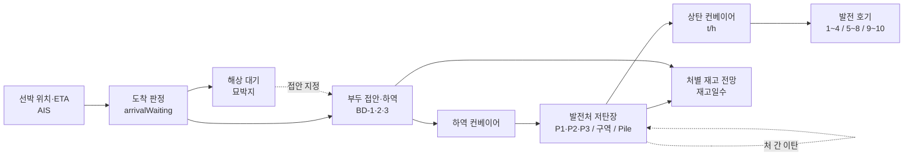

# 저탄장 현황 모듈 (`src/features/stockyard`)

> **상태: POC.** 재고·항차·Pile 수치는 `src/data/control-tower.ts`의 합성 표본(SIMULATED)이다.
> 외부 연계 클라이언트(수급 원장·실시간 AIS·센서)는 구현되어 있지만, 서버가 응답하지 않으면 더미 표본으로 동작한다.
> 지금 저장소의 백엔드에 실제로 있는 연계 지점은 `/api/supply`뿐이다. `/api/v1/vessels`와 `/api/v1/stockpiles/sensors`는 서버 미구현이다.
> 기준시각은 `BASE_TIME` = 2026-10-06 09:00 KST로 고정한다.

이 문서는 두 독자를 위한 것이다.

- **화면·계산을 고치는 개발자**: 1~2장(무엇이 어떻게 동작하는지)
- **다른 시스템을 붙이는 담당자**: 3장(무엇을 어떤 계약으로 넘겨야 하는지)

필드·단위의 원천 정의는 [데이터 사전](../../../docs/DATA_DICTIONARY.md), 제품 범위는 [SPEC](../../../SPEC.md)이 우선한다.
이 문서와 다르면 그 두 문서를 따른다. 화면 구성 근거는 [UI/UX 구성안](../../../docs/plans/2026-10-10-stockyard-ui-ux-plan.md)에 있다.

---

## 1. 한눈에 보기

### 1.1 이 화면이 답하는 질문

1. 처(1~4 / 5~8 / 9~10호기)·발전소별 저탄량과 재고일수는? 언제 소진되는가?
2. 당진항에 도착한 선박은 어느 부두에서 하역 중이고, 누가 바다에서 대기 중인가?
3. 하역분은 어느 처·어느 Pile로 들어가고, Pile별 하역 이력·예정은?
4. 지금 발전소로 올라가는 석탄(상탄)은 시간당 몇 톤인가?
5. 처 간 이탄·접안 부두를 바꾸면 처별 전망이 어떻게 바뀌는가?

### 1.2 화면 구성 (위 → 아래)

| 영역 | 내용 |
|---|---|
| 툴바 | 발전소 칩(앱 공통 조회 범위 안의 하위 선택), Pile 검색, 위험도 필터, 정렬 |
| KPI 7 | 총 저탄량, **최저 재고일수(처)**, 운영 Pile, 가중 열량, 입하 예정, 최장 적치, 고위험 Pile. **모두 클릭 가능** (이동·선택·필터) |
| 알림 | 처 소진 예상, 재고일수 위험·주의, 고위험 Pile, 체선료, AIS STALE, 이탄 가용 초과. 누르면 대상 선택 |
| **항만·저탄장 약도** | 앞바다 → 부두 → 하역 컨베이어 → 1·2·3발전처 저탄장 → 상탄 컨베이어 → 발전소. 헤더에 연계 상태 칩 |
| └ 우측 패널 (탭) | **선박**(일정·체선·접안 지정·하역 원장) / **처**(재고·재고일수·처 간 이탄) / **Pile**(탄질·센서·투입 호기·하역 이력) |
| 기타 발전소 저탄장 | 당진 외 발전소 Pile (전체·타 발전소 범위) |
| 재고 전망 · 입하 예정 | 처별 적층 전망(이탄 전 점선 비교) + 처별 재고일수 표 / 선박별 대기→하역→재고 반영 타임라인 |
| 분석 (탭) | 혼탄 요약(처별 소진·상위 Pile) / 탄종 구성 / 적치·위험 산점도 |
| Pile 원장 | 정렬·처 필터·검색·20행 페이지·CSV, 주간 소진·잔량·하역 예정 열, 행 펼침 상세 |

### 1.3 파일 구성

| 파일 | 역할 |
|---|---|
| `Stockyard.tsx` | 화면 진입점. 범위·선택·이탄·접안 상태, 연계 호출, 계산 연결, 섹션 배치 |
| `StockyardSite.tsx` | 항만·저탄장 약도 장면, 처 헤더(재고일수), 방향키 이동, 연계 상태 칩 |
| `SitePanel.tsx` | 우측 패널 3탭 (선박 / 처 / Pile), 이탄 입력·저장, 하역 원장 등록·보정 |
| `SiteArt.tsx` | 약도 삽화: 벌크선 평면도, 발전소, 해수면 질감 (실사·측량 아님) |
| `PileButton.tsx` | Pile 둔덕 + 하역 이력 배지 + 마우스오버 툴팁 (`PileHistory`) |
| `PileDetail.tsx` | Pile 탄질·센서·투입 호기·하역 이력 (패널·원장·단독 섹션 공용) |
| `StockyardKpis.tsx` | 클릭 가능한 KPI 띠, 알림 칩 |
| `YardForecast.tsx` | 처별/합계 재고 전망 차트와 처별 재고일수 표 |
| `IncomingTimeline.tsx` | 입하·하역 타임라인 표 |
| `StockyardAnalysis.tsx` | 분석 탭 (혼탄 요약·탄종 구성·위험 산점도) |
| `PileLedger.tsx` | Pile 원장 (정렬·필터·페이지·CSV·펼침) |
| `integrations.ts` | 외부 연계 클라이언트와 `useLink` 상태 훅 (3초 시간 제한, 실패 시 더미 유지) |
| `stockyard-domain.ts` | 저탄장 전용 순수 계산 함수 (테스트 대상) |
| `stockyard.css` | 저탄장 전용 스타일과 라이트/다크 색 토큰 (`.stockyard-page` 범위) |

공통 계산(`src/domain/`)과 표본(`src/data/`)은 다른 화면과 공유하므로 여기서 복제하지 않는다.
다른 `features/` 폴더를 직접 import하지 않는다.

---

## 2. 시스템 동작 개요

### 2.1 연료 흐름과 화면의 대응



- 당진은 부두 → 발전처가 **1:1 고정**이다 (`berthMap`: BD-1→P1, BD-2→P2, BD-3→P3).
- 처는 소속 호기를 가진다 (`YARD_UNIT_RANGES`: P1=1~4, P2=5~8, P3=9~10호기). 백엔드 `supply.py`의 `UNITS`와 같은 구분이다.
- P2·P3는 옥내 저탄장(`indoor: true`)이다. 각 처는 탄종 구역 4개(`zone` 0~3) × Pile 5개로 구성된다.
- 표본의 당진 호기는 1·2·9호기뿐이다. 그래서 2발전처(5~8호기)는 소비가 없고 재고일수를 판단하지 않는다("소비 없음"). 지어낸 값이 아니라 표본 그대로의 결과다.

### 2.2 계산 파이프라인

`Stockyard.tsx`는 선택한 범위로 아래 순서를 계산한다. 모두 `stockyard-domain.ts`의 순수 함수이며
`tests/stockyard.test.ts`가 검증한다.

| 단계 | 함수 | 규칙 |
|---|---|---|
| 범위 | `yardScope(plantId, horizon, scopeIds)` | 앱 조회 범위 안. 취소 항차 제외. 공통 `simulate()`로 `horizon`일 전망과 재고일수용 `horizon+7`일 연장 전망 |
| 센서 | `mergeSensorReadings` | 같은 Pile 여러 센서는 최댓값. 6시간 넘은 측정은 버림 |
| AIS | `mergeAisPositions` | MMSI가 일치하는 항차에 위치·수신시각 반영. 하나라도 맞으면 화면 출처 `aisstream` |
| 도착 | `arrivalWaiting(voyages, now)` | 당진행, AIS ETA ≤ **실제 현재 시각** |
| 하역중·대기 | (Stockyard.tsx), `waitingVessels` | 하역중 = `forecast_unload_end ≥ BASE_TIME`. 대기 = `expected_port_wait_h > 0` |
| 약도 선박 | `siteVessels` | 한 항차는 한 번만. 실효 부두 = 접안 지정 > `berth_id` > BD-1. 대기선은 ETA순 |
| 부두 점유 | `berthOccupancy` | 하역중 > 접안 지정된 대기선 > 빈 부두 |
| 추천 부두 | `recommendBerth` | ETA순으로 BD-1부터 순환 배정 (점유 데이터 없음) |
| 하역 귀속 | `attributeByCoalType(piles, voyages, berthOf)` | **실효 부두의 처 안** 같은 탄종 Pile에 재고 비례 배분. 그 처에 같은 탄종이 없을 때만 발전소 전체 |
| 하역 이력 | `historyForPile(pile, attributions, horizon)` | 기준시각부터 조회 기간, 하역일 역순 |
| 재고 관리 단위 | `stockGroups` | 당진은 처(P1~P3), 처 정보가 없는 발전소는 발전소 전체 |
| 처별 전망 | `unitDailyMwh` → `groupForecasts` | 처 사용량 = 발전소 엔진의 일별 요청 연료 × 소속 호기 계획 발전량 비중. 입하는 하역 완료일에 실효 부두의 처로, 이탄은 해당 일에. **처별 부족이 없으면 처 합계 = 발전소 엔진 재고** |
| 재고일수 | `groupForecasts`, `daysStatus` | 현재 = 재고 ÷ 첫날 사용량. 기간 = 일말 재고 ÷ 다음 7일 평균. 상태는 둘 중 낮은 값 |
| 주간 소진 | `weeklyBurnShares` → `groupWeeklyBurn` | 처별 첫 7일 사용량을 그 처 Pile에만, 그 처 소속 호기 기준으로 배분 |
| 혼탄 | `pileBlend` | 소진 전후 가중 열량 |
| 상탄 | `gaugeValue` | 기준시각 출력 표본의 연료 환산 t/h |
| 이탄 | `transferTons` | **초과해도 차단하지 않고 경고만** |
| 타임라인 | `incomingSchedule` | 기간 대비 대기·하역 구간 위치, 하역 완료 순 |
| 원장 | `ledgerRows`, `sortLedger`, `ledgerCsv` | 혼탄 소진·잔량, 하역 예정 귀속량 열. CSV 첫 줄에 기준시각·출처 |
| 알림 | `stockyardAlerts` | 위험 → 주의 → 정보 순. 운영 지시 아님 |
| Pile 크기 | `pileFootprint` | 재고의 세제곱근 비례, 높이 0.35~1 |
| 예시 대기선 | `showSampleWaiting(source)` | 더미 AIS면 표시, 실시간 AIS면 숨김 |

### 2.3 시간·단위 기준

- 재고·입하는 **Pile 합계**가 원천이다. 발전소 종합 KPI도 같은 `stockpiles` 합계를 쓴다.
- 입하량은 **하역 완료 시점**(`forecast_unload_end`)에 재고로 반영한다.
- 단위: 톤 `t`, 발열량 `kcal/kg`, 성상 `%`, 상탄 `t/h`, 시각 **KST**.
- 일별 집계 경계는 기준일 **09:00 ~ 다음 날 09:00**이다 (공통 `simulate()`).
- 전망 기간은 앱 상단 **30/60/90일 선택기**를 따른다 (`horizon` prop).
- 도착 판정과 AIS·센서 최신성은 실제 현재 시각을 쓰고, 나머지는 `BASE_TIME` 고정이다. 그래서 표본 항차는 시간이 지나면 STALE로 보이는 것이 정상이다.
- 기준시각 이전의 이탄은 이미 Pile 재고에 들어 있는 것으로 보고 전망에서 제외한다.

### 2.4 상태 규칙

| 대상 | 상태 | 기준 |
|---|---|---|
| 재고일수 | 위험 / 주의 / 안정 / 소비 없음 | `DAYS_THRESHOLDS` = SPEC §13: 20일 미만 위험, 30일 미만 주의 |
| Pile 위험도 | 낮음 / 관찰 / 높음 | 적치일 × 1.1 + 탄종(인니 15, 그 외 5) + **온도·CO 점수(센서 있을 때)**. 40 관찰, 70 높음. 센서 구간은 `SENSOR_RISK_STEPS`(임시 기준) |
| 위험도 출처 | SIMULATED / SENSOR | 온도·CO 중 하나라도 있으면 SENSOR |
| AIS 최신성 | LIVE / RECENT / ESTIMATED / STALE | 수신 후 10분 / 1시간 / 6시간 이내, 초과 STALE |
| 선박 | 하역중 / 해상 대기 | 2.2 표 |
| 부두 | 하역중 / 접안 지정 / 빈 부두 | `berthOccupancy` |
| 연계 | 확인 중 / 연결 / 미연결 | `useLink`. 미연결이면 마지막 성공 값 또는 더미 |

### 2.5 사용자 조작과 반영 범위

| 조작 | 화면 반영 | 계산 반영 | 저장 |
|---|---|---|---|
| Pile·선박·처 선택 (약도·패널·원장·알림·KPI) | 하나의 선택 상태. 패널 탭 전환, 약도·원장 강조 | - | - |
| Pile 마우스오버·포커스 | 탄질·센서·하역 이력 툴팁 | - | - |
| 방향키 (약도) | ←→ 같은 구역(끝에서 옆 처), ↑↓ 구역 이동, Home/End, Enter 선택, Esc 해제 | - | - |
| 접안 지정 | 선박이 부두로 이동, `모의 적용`, 되돌리기 | 하역 귀속 Pile·처별 입하·전망 | 없음 |
| 처 간 이탄 적용 | 약도 처 태그, `모의 적용`, 되돌리기, 초과 경고 | 처별 전망(이탄 전 점선 비교)·재고일수·알림 | **원장 저장** 버튼 → `/api/supply/transfers` |
| 하역 원장 등록 / 누적 보정 | 패널 선박 탭 | - | `/api/supply/vessels`, `/vessels/{id}/unloading` |
| 위험도 필터·고위험 KPI | 약도 Pile은 흐리게, 원장은 필터 | - | - |
| 정렬 | 구역 내 Pile 순서 | - | - |
| 원장 CSV | 현재 필터·정렬 그대로 내려받기 | - | 파일 |

---

## 3. 다른 시스템 연계

### 3.1 연계 원칙

1. **Adapter만 교체한다.** 외부 자료는 서버에서 아래 계약 형태로 정규화한 뒤 화면에 넘긴다. 화면·계산 함수는 바꾸지 않는다.
2. **브라우저에 비밀키를 두지 않는다.** 클라이언트는 같은 출처의 `/api`만 부른다. AIS 키 등은 서버 환경변수에 둔다. `VITE_` 변수는 비밀 보관 장소가 아니다.
3. **프론트는 DB에 직접 접근하지 않는다** (SPEC §10).
4. **식별자·단위·시각을 임의로 바꾸지 않는다.** `plant_id`, `stockpile_id`, `destination_plant_id`, `t`, `kcal/kg`, KST, 하역 완료 시 재고 반영. 변경이 필요하면 계약 문서·테스트와 함께 통합 담당 리뷰를 받는다.
5. **출처와 최신성을 같이 넘긴다.** `source`, `received_at` / `measured_at`이 있어야 화면이 더미/실측과 STALE을 구분한다.
6. **처 단위 자료를 Pile로 임의 분배하지 않는다.** Pile 정보가 없으면 처 단위로 표시한다 ([이관 기록](../../../docs/MIDTERM_INTEGRATION.md)).
7. **실패해도 화면은 멈추지 않는다.** 모든 호출은 3초 시간 제한이 있고, 실패하면 마지막 성공 값 또는 더미 표본을 쓴다. 오프라인 단일 HTML(`file://`)에서는 호출하지 않는다.

### 3.2 연계 지점 한눈에

| 외부 시스템 | 저탄장이 받는 데이터 | 엔드포인트 (클라이언트) | 서버 상태 | 화면 반영 |
|---|---|---|---|---|
| 당진 연료수급 원장 | 이탄 원장, 선박 하역 원장 | `GET /api/supply/records` (`fetchSupplyRecords`) | **구현됨** (`backend/`) | 저장 이탄이 처 전망에 반영, 선박 탭에 원장 누적 하역 |
| 〃 이탄 저장 | - | `POST /api/supply/transfers` (`saveSupplyTransfer`) | **구현됨** | 처 탭 "원장 저장" |
| 〃 하역 등록·보정 | - | `POST /api/supply/vessels`, `POST /api/supply/vessels/{id}/unloading` | **구현됨** | 선박 탭 "원장 등록"·"보정 저장" |
| AIS (AISstream → 유료 위성 AIS) | 위치·SOG/COG·수신시각 | `GET /api/v1/vessels?plant_id=` (`fetchAisPositions`, SPEC §10) | 미구현 | 최신성, 예시 대기선 숨김 |
| 저탄장 센서 | Pile 온도·CO | `GET /api/v1/stockpiles/sensors[?plant_id=]` (`fetchSensorReadings`, 3.6 제안) | 미구현 | 위험도 SENSOR, 툴팁·상세 측정값 |
| 저탄장 관리(측량·스태커/리클레이머) | Pile 재고·위치·적치일 | `GET /api/v1/stockpiles?plant_id=` (SPEC §10) | 미구현 | **아직 연결하지 않음** (3.8) |
| 선적·계약(구매/ERP) | 항차·물량·탄질 | `voyages` 원천 교체 | 없음 | - |
| 발전계획(KPX·MILP)·DCS | 호기별 시간 출력 | `/api/supply/plans`의 `PlanBatch` | 구현됨 (저탄장 미연결) | 3.8 |

### 3.3 저탄장이 받는 입력 계약

필드 정의는 `src/data/control-tower.ts`의 타입이 기준이다.

**Stockpile** (Pile 1개)

| 필드 | 단위·형식 | 필수 | 비고 |
|---|---|---|---|
| `stockpile_id` | 문자열 (`DA-01`) | ✓ | 화면 라벨은 `-` 앞을 접두어로 본다 |
| `plant_id` | `dangjin` 등 | ✓ | |
| `coal_type` | 문자열 | ✓ | 하역 귀속은 탄종 **정확 일치** |
| `on_hand_t` | t | ✓ | 합계가 발전소 재고 |
| `calorific_value_kcal_kg` | kcal/kg | ✓ | |
| `moisture_pct`, `ash_pct`, `sulfur_pct` | % | ✓ | |
| `stacked_at` | ISO 8601 (KST 오프셋 권장) | ✓ | 적치일·위험도 |
| `eligible_unit_ids` | 호기 ID 배열 | ✓ | 혼탄 제한. 주간 소진은 이 중 **처 소속 호기**만 |
| `temperature_c`, `co_ppm` | ℃, ppm | 선택 | 센서 연계 시 채워짐. 없으면 null → "미연결" |
| `berth_id`, `plant_yard`, `indoor`, `zone` | `BD-n`, `Pn`, bool, 0~3 | 당진 약도용 | 타 발전소는 null/false |

**Voyage** (항차 1개, 이 모듈이 쓰는 필드)

| 필드 | 단위·형식 | 용도 |
|---|---|---|
| `voyage_id`, `vessel_name`, `mmsi` | 문자열 | 선택·표시, AIS·원장 매칭 (원장은 선박명) |
| `destination_plant_id` | `plant_id` | 범위 |
| `voyage_status` | `active` / `cancelled` | 취소 제외 |
| `ais_eta`, `received_at` | ISO 8601 | 도착 판정, 최신성 |
| `forecast_unload_end` | ISO 8601 | 하역중 판정, **재고 반영 시점** |
| `cargo_t`, `coal_type`, 성상 4종 | t, %, kcal/kg | 입하·귀속·이력 |
| `weather_delay_h`, `route_delay_h`, `expected_port_wait_h`, `allowed_laytime_h`, `demurrage_usd_per_day` | h, $/day | 접안 예정·체선료 (`voyageTiming`) |
| `berth_id` | `BD-1`~`BD-3` | 기본 접안 부두 |
| `transfer_capacity_t` | t | 이탄 가용 상한 표본 (항차 필드에 있는 것은 POC 임시) |

### 3.4 저탄장이 내보내는 값

| 값 | 쓰는 곳 | 주의 |
|---|---|---|
| Pile 합계 재고 | 발전소 종합 KPI, 재고 전망 | 두 화면이 반드시 같은 값 (POC 완료 기준) |
| 처별 재고·재고일수·소진 예상 | KPI, 처 탭, 전망 표, 알림 | 처별 부족 전까지 처 합계 = 발전소 엔진 |
| 하역 귀속·이력 | Pile 툴팁·상세·원장 | 실효 부두의 처 안 탄종 비례 **추정** |
| 주간 소진·혼탄 | 분석, 원장 열 | 운영 지시 아님 |
| 이탄 원장 | `/api/supply/transfers` | 저장 버튼을 누를 때만 |
| 원장 CSV | 사용자 파일 | 첫 줄 기준시각·출처 |

### 3.5 Python 백엔드(`/api/supply`)와의 매핑

| 개념 | 저탄장 화면 (React) | `/api/supply` (Python) | 구현된 변환 |
|---|---|---|---|
| 처 ID | `P1`·`P2`·`P3` | `g14`·`g58`·`g910` | `YARD_GROUP_IDS`, `toSupplyTransfer`, `fromSupplyTransfers`. 매핑 없는 처는 버림 |
| 처 소속 호기 | 이름의 호기 번호 (1~4/5~8/9~10) | `UNITS` (당진1~10) | `YARD_UNIT_RANGES` |
| 재고 단위 | Pile | 처 단위 기준재고 (`POST /baselines`) | **연결 안 함** (Pile로 나누지 않음) |
| 부두 | BD-1~3, 1:1 처 | 선박별 처 배분비율 `allocations` | `toSupplyVessel`: 실효 부두의 처에 1, 나머지 0 |
| 하역 반영 | 하역 완료 시점에 일괄 | 누적 하역량 진행 반영 | 화면은 원장 누적을 **표시만** 하고 재고 반영 규칙은 바꾸지 않음 (`supplyCumulative`) |
| 하역 속도 | 없음 | `rate` t/h | 등록 시 화물 ÷ (접안 → 하역 완료) 평균. 보정 시 마지막 속도·배분 유지 |
| 이탄 | 시각·비고 포함 모의 | `at`, `from_group`, `to_group`, `tonnes`, `note` | 그대로 저장. 백엔드에 삭제 API가 없어 저장분은 되돌릴 수 없음 |
| 선박 매칭 | `vessel_name` | `name` | 이름 일치 (IMO/MMSI 필드가 원장에 생기면 교체) |
| 상탄·소진 | 기준시각 출력 표본 | 호기별 시간 계획 `PlanBatch` | 미연결 (3.8) |
| 일 경계 | 09:00 ~ 09:00 | KST 00:00 ~ 24:00 | 미변환 (3.8) |
| 재고일수 위험 | 20/30일 (SPEC) | 7/15일 (DB 설정) | 화면은 `DAYS_THRESHOLDS`. 통일 필요 (3.8) |

### 3.6 센서 측정 계약 (제안, 클라이언트 구현됨)

`GET /api/v1/stockpiles/sensors?plant_id=dangjin` → 배열 또는 `{ "readings": [...] }`

```json
{
  "stockpile_id": "DA-04",
  "measured_at": "2026-10-06T08:55:00+09:00",
  "temperature_c": 41.5,
  "co_ppm": 18,
  "sensor_id": "DJ-P3-T07",
  "source": "yard-sensor"
}
```

- 같은 Pile에 여러 센서가 있으면 온도·CO 각각 최댓값을 쓴다.
- `measured_at`이 6시간보다 오래되거나 미래면 버린다.
- 점수: 온도 40/50/60℃ 이상 +10/+25/+40, CO 20/50/100ppm 이상 +8/+20/+35 (`SENSOR_RISK_STEPS`, **임시 기준**).

AIS는 SPEC §9.3 `VesselPosition`(배열 또는 `{ "positions": [...] }`)을 받고 `source: "aisstream"`만 실시간으로 본다.

### 3.7 연계 절차 체크리스트

1. 외부 원천과 필드 매핑표를 만든다 (3.3 표 기준, 단위·시간대 포함).
2. 서버에서 정규화한다. 비밀키는 서버에만 둔다.
3. 위 엔드포인트를 구현하면 화면은 자동으로 붙는다. 헤더의 연계 칩이 "연결"로 바뀌는지 본다.
4. 출처 배지·최신성(LIVE/STALE)·"미연결" 문구가 실제 상태와 맞는지 확인한다.
5. 회귀 테스트를 추가한다. 최소한 다음을 검증한다.
   - Pile 합계 = 발전소 종합 현재 재고, 처 합계 = 발전소 엔진 재고 (부족 전)
   - 취소 항차 제외, 하역 완료 시점 재고 반영
   - 한 항차가 약도에 한 번만 나옴, 오래된 AIS·센서가 최신처럼 보이지 않음
   - 저장 요청 본문의 처 ID가 `g14/g58/g910`
6. 아래 4장 명령을 모두 통과시키고, 공통 계약을 바꿨다면 PR에 표시해 통합 담당 리뷰를 받는다.

### 3.8 아직 연결하지 않은 것

- **Pile 원장 원천 교체**: Pile 재고를 외부에서 받으면 발전소 종합 KPI도 같은 원천을 써야 한다. 저탄장 화면만 바꾸면 두 화면 합계가 어긋나므로 `src/data`·App 수준에서 통합 담당이 연결한다.
- **발전계획(`PlanBatch`)**: 상탄 t/h와 소진은 아직 기준시각 출력 표본이다. 연결 시 설계대로 "계획 기반 예상 사용량"으로 표기한다.
- **일 경계(09시 vs 0시)·재고일수 기준(20/30 vs 7/15)**: 통합 담당 결정 사항.

---

## 4. 검증

```sh
npm test         # tests/stockyard.test.ts 등 계산 단위 테스트
npm run build    # 타입 검사 + 단일 HTML 빌드
npm run test:ui  # tests/ui.spec.ts (저탄장 4개: 약도·상호작용·연계 목업·Pile 상세)
```

- UI 테스트는 개발 서버를 재사용한다. 실행 중에 소스를 고치면 HMR로 화면이 초기화되어 실패할 수 있다.
- 연계 테스트는 `page.route`로 `/api/supply/*`, `/api/v1/*` 응답을 흉내 낸다. 백엔드가 꺼져 있으면 브라우저 콘솔에 502가 찍히는 것은 정상이다 (화면은 더미로 동작).

## 5. 알려진 제한

- 접안 지정은 저장되지 않는다 (백엔드에 부두 지정 API 없음).
- 저장된 이탄은 화면에서 되돌릴 수 없다 (백엔드에 삭제 API 없음).
- 하역 귀속은 탄종 비례 추정이다. 실제 스태킹 기록이 오면 그것을 우선한다.
- 추천 부두는 점유·하역 속도를 보지 않는 ETA 순환 규칙이다.
- 약도 배치·선박 위치는 예시이며 측량·AIS 좌표가 아니다.
- 원장 선박 매칭은 선박명 기준이다.
